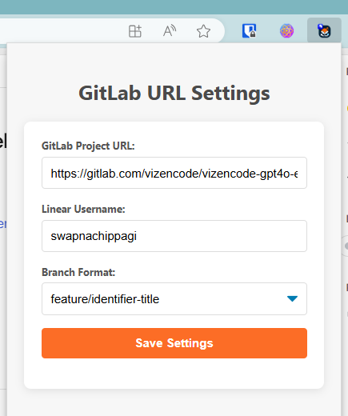
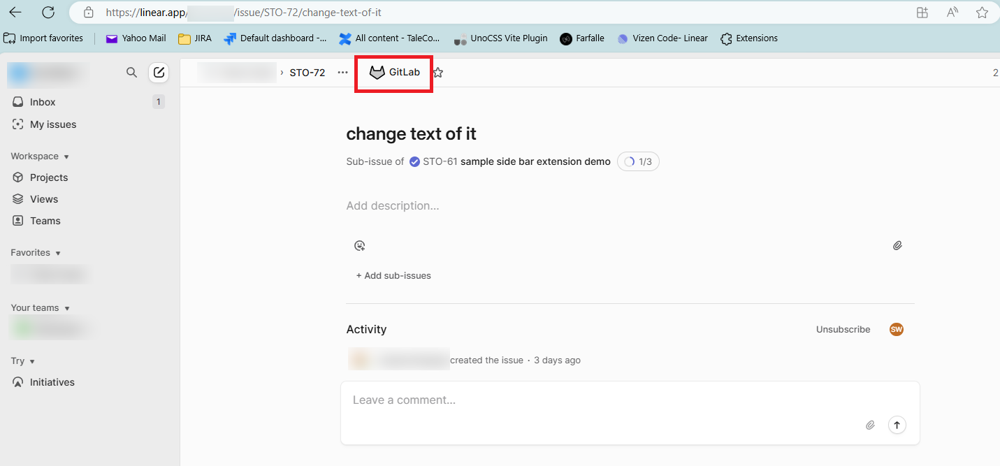

[](logo.png)
# Linear Lab Linker: GitLab Branch Connector

## Description

"Linear Lab Linker" is a browser extension that enhances the integration between Linear.app and GitLab. It automatically adds a direct link to the corresponding GitLab branch on Linear issue pages, improving workflow efficiency for developers.

## Features

- Adds a direct link to the GitLab branch on Linear issue pages
- Eliminates the need to wait for a Merge Request to see the branch link
- Streamlines the development workflow between Linear and GitLab

## Installation

### Step 1: Download or Clone the Repository

1. **Download the Extension**: 
   - Click on the green "Code" button at the top right of this page.
   - Select "Download ZIP" to download the repository to your local machine.
   - Unzip the downloaded file.

   **OR**

   **Clone the Repository**:
   - Open your terminal.
   - Run the following command to clone the repository:
     ```bash
     git clone https://github.com/yashwanth2804/Linear-gitlab-extention.git
     ```
   - Navigate to the project directory:
     ```bash
     cd gitlab-branch-linker-linear
     ```

### Step 2: Load the Extension in Your Browser

1. **Open Chrome/Edge**:
   - Go to `chrome://extensions/` or `edge://extensions/` in your browser's address bar.

2. **Enable Developer Mode**:
   - In the top right corner, toggle the "Developer mode" switch to "On."

3. **Load Unpacked Extension**:
   - Click the "Load unpacked" button.
   - Browse to the directory where you unzipped or cloned the repository, and select the root folder.

4. **The Extension is Now Installed**:
   - The extension will now appear in your list of installed extensions. You should see its icon in the browser toolbar.

### Step 3: Setting up the Extension

[](demo_img/extesnionui.png)


1. **Adding GitLab Branch Link**:
   - Click on the Extention icon in the browser toolbar. This will open the extension popup.
   - Click on the "Add GitLab Branch Link" input and enter the URL of the GitLab project.
   - Enter your username in the "Your Linear username" input.
   - Select the branch format in the "Branch Format" dropdown.
   - Finally click on "Save Settings",and reload the page.

> hint: Goto [Linear gitlab settings](https://linear.app/settings/integrations/gitlab) to get your branch format.   
    

[](demo_img/usage.png)
2. **Create a Linear Issue**:
   - When you create a new issue in Linear, the extension will automatically generate the corresponding GitLab branch link.
   - The link will be displayed directly on the Linear issue page.

### Updating the Extension

1. **To Update**:
   - Pull the latest changes from the GitHub repository or re-download the ZIP file.
   - Go to the extensions page in your browser (`chrome://extensions/` or `edge://extensions/`).
   - Click the "Reload" button on the extension to update it.
 

## Contributing

Contributions to LinearLink are welcome! Please feel free to submit a Pull Request.

## License

MIT

## Support

If you encounter any problems or have any questions, please file an issue on the GitHub repository.

## Acknowledgements

Thanks to all the developers who use Linear and GitLab in their daily workflow. Your needs inspired this project.

## Credits

https://www.svgrepo.com/svg/363652/gitlab-logo-simple-duotone

